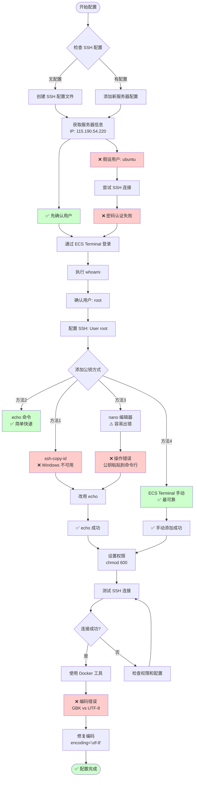
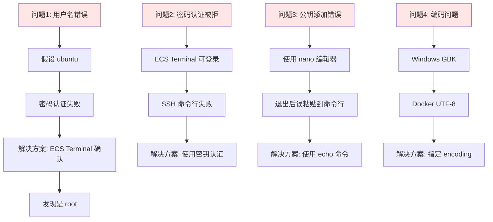
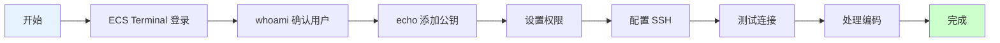
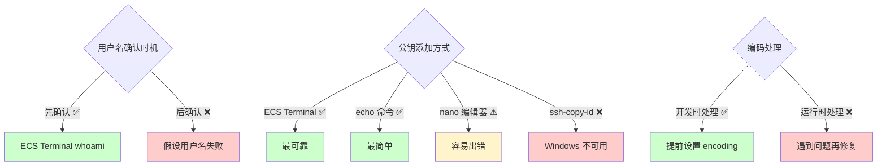

# SSH 配置流程图 - 可视化版本

## 🎯 完整配置流程



## ❌ 遇到的问题路径



## ✅ 最优路径（如果重新来）



## 🔀 关键决策点



## 📊 时间对比

```mermaid
gantt
    title 配置时间对比
    dateFormat X
    axisFormat %s秒
    
    section 实际流程
    假设用户名并配置        :0, 300
    密码认证失败            :300, 600
    确认用户名              :600, 900
    尝试多种添加方式        :900, 1800
    修复编码问题            :1800, 2100
    
    section 最优流程
    确认用户名              :0, 60
    添加公钥                :60, 120
    配置和测试              :120, 300
    处理编码                :300, 360
```



## 🎓 经验教训总结

### 1. 先确认，再配置
```
❌ 错误: 假设用户名 → 配置 → 失败 → 重新配置
✅ 正确: 确认用户名 → 配置 → 成功
```

### 2. 选择最简单可靠的方法
```
❌ 错误: 尝试复杂方法 → 出错 → 修复
✅ 正确: 选择最简单方法 → 一次成功
```

### 3. 提前考虑兼容性
```
❌ 错误: 开发 → 测试 → 发现问题 → 修复
✅ 正确: 开发时考虑兼容性 → 测试通过
```

---

*查看详细分析请参考: `配置总结与问题分析.md`*

