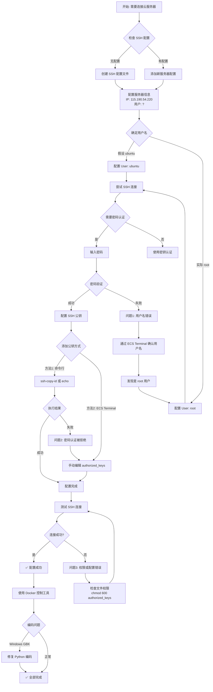
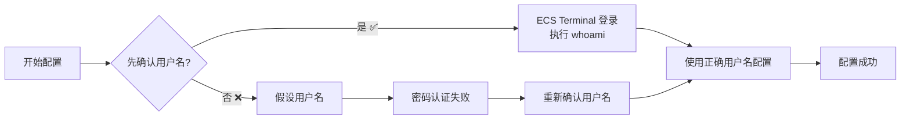
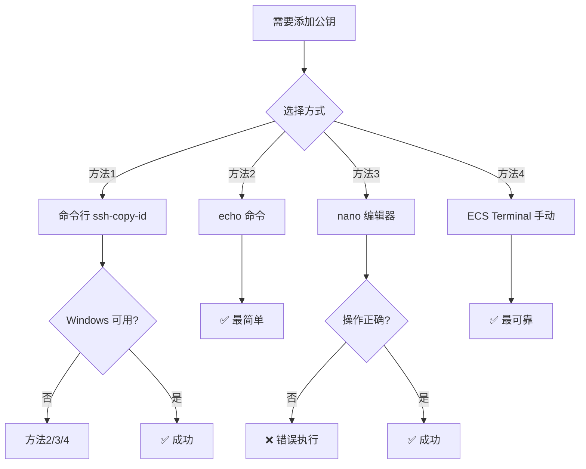
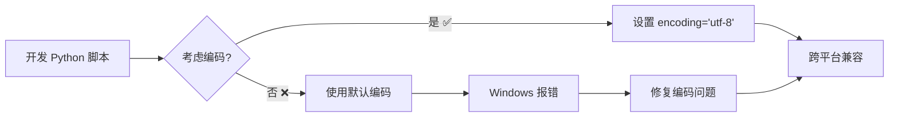

# SSH 远程连接配置总结与问题分析

## 📊 配置流程图



## 🔴 遇到的问题及解决方案

### 问题 1: 用户名错误导致密码认证失败

**现象:**
- 使用 `ubuntu@115.190.54.220` 连接时密码认证失败
- 提示 "Permission denied"

**原因:**
- 初始假设用户名为 `ubuntu`（Ubuntu 系统常见）
- 实际服务器用户名为 `root`

**解决方案:**
1. 通过 ECS Terminal 登录服务器
2. 执行 `whoami` 确认实际用户名
3. 更新 SSH 配置中的 `User` 字段为 `root`

**错过的分支:**
- ❌ 没有先确认用户名就配置
- ✅ 应该先通过 ECS Terminal 确认用户信息

---

### 问题 2: SSH 密码认证被拒绝

**现象:**
- ECS Terminal 可以正常登录
- 但 SSH 命令行连接时密码认证失败

**原因:**
- ECS Terminal 和 SSH 可能使用不同的认证机制
- SSH 服务可能配置了限制

**解决方案:**
- 使用 ECS Terminal 手动添加 SSH 公钥
- 避免依赖密码认证，改用密钥认证

**错过的分支:**
- ❌ 尝试多次密码登录（浪费时间）
- ✅ 应该直接使用 ECS Terminal 添加公钥

---

### 问题 3: 公钥添加方式错误

**现象:**
- 在 ECS Terminal 中使用 `nano` 编辑时
- 退出编辑器后误将公钥粘贴到命令行
- 导致 bash 将公钥当作命令执行

**原因:**
- 不熟悉 `nano` 编辑器操作
- 没有正确理解编辑器的保存流程

**解决方案:**
- 使用 `echo` 命令直接追加公钥（更简单）
- 或正确使用 `nano`：粘贴 → Ctrl+O → Enter → Ctrl+X

**错过的分支:**
- ❌ 使用编辑器方式（容易出错）
- ✅ 应该使用 `echo` 命令（一行搞定）

---

### 问题 4: Windows 编码问题

**现象:**
- Python 脚本执行时出现 `UnicodeDecodeError`
- 错误信息：`'gbk' codec can't decode byte 0xa6`

**原因:**
- Windows PowerShell 默认使用 GBK 编码
- Docker 输出使用 UTF-8 编码
- `subprocess.run` 没有指定编码

**解决方案:**
```python
subprocess.run(
    ssh_cmd,
    encoding='utf-8',
    errors='replace',  # 处理无法解码的字符
    ...
)
```

**错过的分支:**
- ❌ 没有考虑跨平台编码问题
- ✅ 应该在开发时就处理编码

---

## ⚠️ 核心注意事项

### 1. SSH 配置优先级

```
配置文件位置: ~/.ssh/config (Windows: C:\Users\用户名\.ssh\config)

配置项优先级:
1. 命令行参数 (-u, -p, -i) > SSH 配置文件 > 系统默认
2. 第一个匹配的 Host 配置会被使用
```

### 2. 用户名的确定方法

```bash
# 方法1: 通过 ECS Terminal 确认（最可靠）
whoami

# 方法2: 查看系统信息
cat /etc/passwd | grep -E "^(root|ubuntu|admin)"

# 方法3: 尝试常见用户名
# - Ubuntu: ubuntu
# - CentOS: root 或 centos
# - Debian: root 或 debian
```

### 3. SSH 密钥认证流程

```
本地生成密钥对
    ↓
id_rsa (私钥) - 保留在本地，保密
id_rsa.pub (公钥) - 添加到服务器的 ~/.ssh/authorized_keys
    ↓
SSH 连接时自动使用私钥认证
    ↓
无需密码登录
```

### 4. 文件权限要求（Linux）

```bash
~/.ssh              → 700 (drwx------)
~/.ssh/authorized_keys → 600 (-rw-------)
~/.ssh/id_rsa       → 600 (-rw-------)
~/.ssh/id_rsa.pub   → 644 (-rw-r--r--)
```

### 5. 公钥添加的三种方式对比

| 方式 | 优点 | 缺点 | 推荐度 |
|------|------|------|--------|
| `ssh-copy-id` | 自动化，一步完成 | Windows 可能不可用 | ⭐⭐⭐ |
| `echo` 命令 | 简单，一行搞定 | 需要手动复制公钥 | ⭐⭐⭐⭐ |
| `nano` 编辑 | 可视化，可检查 | 容易操作错误 | ⭐⭐ |
| ECS Terminal | 最可靠，不依赖网络 | 需要登录控制台 | ⭐⭐⭐⭐⭐ |

---

## 🔀 错过的分支/替代方案

### 分支 1: 用户名确认时机



**教训:** 应该先确认用户名，再配置 SSH

---

### 分支 2: 公钥添加方式选择



**教训:** 
- 优先使用 ECS Terminal（最可靠）
- 其次使用 echo 命令（最简单）
- 避免在不熟悉的情况下使用编辑器

---

### 分支 3: 编码问题预防



**教训:** 开发时就应考虑跨平台兼容性

---

## 📋 最佳实践 checklist

### 配置前准备
- [ ] 确认服务器 IP 地址
- [ ] 确认 SSH 端口（默认 22）
- [ ] 通过 ECS Terminal 确认用户名
- [ ] 确认是否有 SSH 密钥对
- [ ] 确认服务器安全组开放 SSH 端口

### 配置过程
- [ ] 创建/更新 SSH 配置文件
- [ ] 使用正确的用户名
- [ ] 通过 ECS Terminal 添加公钥（最可靠）
- [ ] 设置正确的文件权限
- [ ] 测试 SSH 连接

### 配置后验证
- [ ] `ssh myserver` 可以无密码登录
- [ ] Cursor Remote SSH 可以连接
- [ ] Docker 控制工具可以正常工作
- [ ] 处理编码问题（如需要）

---

## 🎯 关键经验总结

1. **先确认，再配置**
   - 不要假设用户名，先通过 ECS Terminal 确认

2. **优先使用密钥认证**
   - 比密码认证更安全、更方便

3. **选择最简单可靠的方法**
   - ECS Terminal 手动添加 > echo 命令 > 其他方式

4. **注意跨平台兼容性**
   - Windows/Linux 编码差异
   - 路径格式差异

5. **测试每个步骤**
   - 配置后立即测试，及时发现问题

---

## 📚 相关文件

- `C:\Users\Administrator\.ssh\config` - SSH 配置文件
- `docker_remote.py` - Docker 远程控制工具
- `setup_ssh_key.ps1` - 自动配置脚本
- `快速配置指南.md` - 详细操作指南

---

## 🔄 如果重新来一次

**最优流程:**
```
1. 通过 ECS Terminal 登录 → 执行 whoami → 确认用户名
2. 在 ECS Terminal 中执行 echo 命令添加公钥
3. 设置文件权限 chmod 600 ~/.ssh/authorized_keys
4. 配置 SSH config 文件（使用确认的用户名）
5. 测试连接 ssh myserver
6. 在开发时就处理编码问题
```

**预计时间:** 5-10 分钟（vs 实际花费的 30+ 分钟）

---

*最后更新: 2026-01-07*

