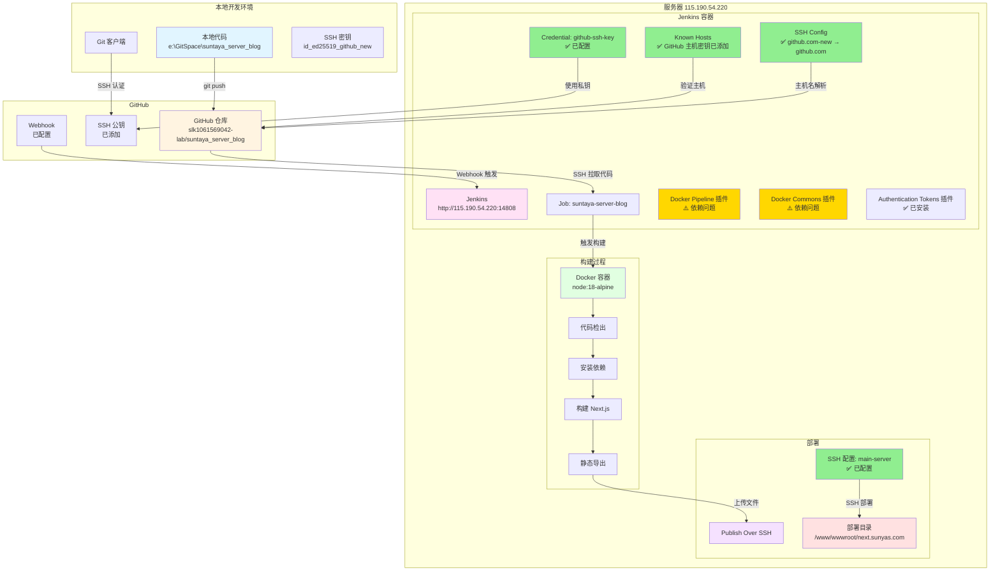

# Jenkins 自动部署架构图

**时间**: 2026-01-19  
**项目**: suntaya_server_blog 自动部署流程

## 📊 系统架构图



## 🔍 组件状态详情

### ✅ 已验证通过的配置

| 组件 | 配置项 | 状态 | 说明 |
|------|--------|------|------|
| **GitHub** | SSH 公钥 | ✅ 已验证 | `id_ed25519_github_new.pub` 已添加到 GitHub |
| **GitHub** | Webhook | ✅ 已配置 | 指向 `http://115.190.54.220:14808/github-webhook/` |
| **Jenkins** | Repository URL | ✅ 已验证 | `git@github.com:slk1061569042-lab/suntaya_server_blog.git` |
| **Jenkins** | Branch | ✅ 已验证 | `*/main` |
| **Jenkins** | Credential | ✅ 已验证 | `github-ssh-key` 已配置，私钥正确 |
| **Jenkins** | SSH Config | ✅ 已配置 | `github.com-new` → `github.com` |
| **Jenkins** | Known Hosts | ✅ 已添加 | GitHub ED25519 主机密钥已添加 |
| **Jenkins** | Publish Over SSH | ✅ 已配置 | `main-server` 配置正确 |
| **Jenkinsfile** | Agent 配置 | ✅ 已恢复 | 使用 `agent { docker { ... } }` |

### ⚠️ 当前问题

| 组件 | 问题 | 状态 | 影响 |
|------|------|------|------|
| **Docker Pipeline** | 依赖错误 | ⚠️ 部分解决 | 缺少 `docker-commons` → 已安装，但 `docker-commons` 缺少 `authentication-tokens` → 已安装 |
| **Docker Commons** | 依赖错误 | ⚠️ 已解决 | 缺少 `authentication-tokens` → ✅ 已安装 |
| **Authentication Tokens** | - | ✅ 已安装 | 无依赖问题 |

### 🔄 数据流向

```
1. 本地代码 (A)
   └─> git push
       └─> GitHub 仓库 (B)
           ├─> Webhook 触发
           │   └─> Jenkins (C)
           └─> SSH 拉取
               └─> Jenkins Job (C1)
                   ├─> 使用 Credential (C2) 认证
                   ├─> 使用 SSH Config (C3) 解析主机名
                   └─> 使用 Known Hosts (C4) 验证主机
                       └─> 代码检出成功
                           └─> Docker 容器 (D)
                               ├─> 安装依赖 (D2)
                               ├─> 构建 (D3)
                               └─> 静态导出 (D4)
                                   └─> Publish Over SSH (E)
                                       └─> 部署目录 (F)
```

## 📋 验证检查表

### 阶段 1: GitHub 配置 ✅

- [x] SSH 公钥已添加到 GitHub
- [x] Webhook 已配置
- [x] 仓库 URL 正确

### 阶段 2: Jenkins 连接配置 ✅

- [x] Repository URL 配置正确
- [x] Branch 配置正确 (`*/main`)
- [x] Credential 配置正确 (`github-ssh-key`)
- [x] SSH Config 已创建
- [x] Known Hosts 已添加 GitHub 主机密钥

### 阶段 3: Jenkins 插件 ⚠️

- [x] Docker Pipeline 插件已安装
- [x] Docker Commons 插件已安装
- [x] Authentication Tokens 插件已安装
- [ ] **待验证**: 所有依赖是否已完全解决（需要重启后检查）

### 阶段 4: Jenkinsfile 配置 ✅

- [x] Agent 配置已恢复为 `agent { docker { ... } }`
- [x] 所有步骤已移除 `docker run` 命令
- [x] 直接使用 `npm` 命令

### 阶段 5: 构建和部署 ⏳

- [ ] 代码拉取成功
- [ ] 依赖安装成功
- [ ] 构建成功
- [ ] 静态导出成功
- [ ] SSH 部署成功

## 🎯 当前状态总结

### ✅ 已完成

1. **GitHub 配置**: SSH 公钥、Webhook 已配置
2. **Jenkins 基础配置**: Repository URL、Branch、Credential 已配置
3. **SSH 连接配置**: SSH Config、Known Hosts 已配置
4. **Jenkinsfile**: 已恢复为 Docker Pipeline 原生语法
5. **插件安装**: Docker Pipeline、Docker Commons、Authentication Tokens 已安装

### ⚠️ 待验证

1. **插件依赖**: 需要重启 Jenkins 后验证所有依赖是否已解决
2. **构建测试**: 需要触发一次构建验证整个流程

### 🔄 下一步

1. **等待 Jenkins 重启完成**（1-2 分钟）
2. **验证插件依赖**: 在插件管理中检查是否还有依赖错误
3. **触发构建**: 在 Jenkins 中触发一次构建测试
4. **查看构建日志**: 确认每个阶段是否成功

---

**提示**: 绿色 ✅ 表示已验证通过，黄色 ⚠️ 表示需要验证，灰色 ⏳ 表示待测试。
