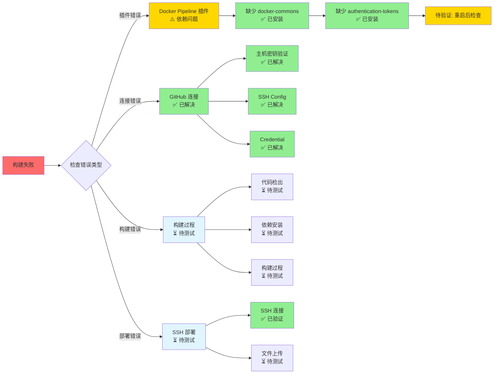

# 自动部署流程状态图

**时间**: 2026-01-19  
**项目**: suntaya_server_blog

## 🔄 完整流程状态图

```mermaid
flowchart TD
    Start([开始]) --> Local[本地开发环境]
    
    Local -->|1. git push| GitHub[GitHub 仓库]
    
    GitHub -->|2. Webhook 触发| Jenkins[Jenkins 服务器]
    GitHub -->|2. SSH 拉取代码| Jenkins
    
    Jenkins -->|3. 验证配置| Check1{Repository URL<br/>✅ 已验证}
    Check1 -->|通过| Check2{Credential<br/>✅ 已验证}
    Check2 -->|通过| Check3{SSH Config<br/>✅ 已配置}
    Check3 -->|通过| Check4{Known Hosts<br/>✅ 已添加}
    Check4 -->|通过| Check5{Docker Pipeline 插件<br/>⚠️ 待验证}
    
    Check5 -->|通过| Build[构建阶段]
    Check5 -->|失败| Error1[❌ 插件依赖错误]
    
    Build --> Stage1[Stage 1: Checkout<br/>代码检出]
    Stage1 -->|✅ 配置正确| Stage2[Stage 2: Install<br/>安装依赖]
    Stage2 -->|✅ 配置正确| Stage3[Stage 3: Lint<br/>代码检查]
    Stage3 -->|✅ 配置正确| Stage4[Stage 4: Build<br/>构建 Next.js]
    Stage4 -->|✅ 配置正确| Stage5[Stage 5: Export<br/>静态导出]
    Stage5 -->|✅ 配置正确| Stage6[Stage 6: Deploy<br/>SSH 部署]
    
    Stage6 -->|✅ 配置正确| Deploy[部署目录<br/>/www/wwwroot/next.sunyas.com]
    
    Deploy --> Success([✅ 部署成功])
    Error1 --> Fail([❌ 部署失败])
    
    style Start fill:#e1f5ff
    style GitHub fill:#fff4e1
    style Jenkins fill:#ffe1f5
    style Check1 fill:#90ee90
    style Check2 fill:#90ee90
    style Check3 fill:#90ee90
    style Check4 fill:#90ee90
    style Check5 fill:#ffd700
    style Stage1 fill:#e1ffe1
    style Stage2 fill:#e1ffe1
    style Stage3 fill:#e1ffe1
    style Stage4 fill:#e1ffe1
    style Stage5 fill:#e1ffe1
    style Stage6 fill:#e1ffe1
    style Deploy fill:#ffe1e1
    style Success fill:#90ee90
    style Fail fill:#ff6b6b
    style Error1 fill:#ff6b6b
```

## 📊 组件连接状态表

### 连接 1: 本地 → GitHub

| 项目 | 状态 | 验证方式 |
|------|------|----------|
| SSH 认证 | ✅ 已验证 | `ssh -T git@github.com-new` 成功 |
| 公钥配置 | ✅ 已验证 | GitHub Settings → SSH Keys 中可见 |
| 仓库访问 | ✅ 已验证 | `git push` 成功 |

### 连接 2: GitHub → Jenkins

| 项目 | 状态 | 验证方式 |
|------|------|----------|
| Webhook 配置 | ✅ 已验证 | GitHub Settings → Webhooks 中可见 |
| Webhook URL | ✅ 已验证 | `http://115.190.54.220:14808/github-webhook/` |
| Webhook 触发 | ⏳ 待测试 | 需要推送代码测试 |

### 连接 3: Jenkins → GitHub (代码拉取)

| 项目 | 状态 | 验证方式 |
|------|------|----------|
| Repository URL | ✅ 已验证 | `git@github.com:slk1061569042-lab/suntaya_server_blog.git` |
| Branch | ✅ 已验证 | `*/main` |
| Credential | ✅ 已验证 | `github-ssh-key` 已配置 |
| SSH Config | ✅ 已验证 | `/var/jenkins_home/.ssh/config` 已创建 |
| Known Hosts | ✅ 已验证 | GitHub 主机密钥已添加 |
| 代码拉取 | ⏳ 待测试 | 需要触发构建测试 |

### 连接 4: Jenkins → Docker (构建环境)

| 项目 | 状态 | 验证方式 |
|------|------|----------|
| Docker Pipeline 插件 | ⚠️ 部分解决 | 已安装，但依赖待验证 |
| Docker Commons 插件 | ✅ 已安装 | 已安装 |
| Authentication Tokens | ✅ 已安装 | 已安装 |
| Docker 可用性 | ✅ 已验证 | Jenkins 容器内有 Docker (v29.1.3) |
| Agent 配置 | ✅ 已验证 | `agent { docker { image 'node:18-alpine' } }` |
| 构建执行 | ⏳ 待测试 | 需要触发构建测试 |

### 连接 5: Jenkins → 服务器 (部署)

| 项目 | 状态 | 验证方式 |
|------|------|----------|
| Publish Over SSH | ✅ 已验证 | `main-server` 配置正确 |
| SSH 连接 | ✅ 已验证 | 在 Jenkins Web UI 中测试通过 |
| 部署目录 | ⏳ 待验证 | 需要检查 `/www/wwwroot/next.sunyas.com` 权限 |
| 文件上传 | ⏳ 待测试 | 需要触发构建测试 |

## 🎯 问题定位图

## 📋 验证状态汇总

### ✅ 已验证通过（绿色）

1. **GitHub 配置**
   - SSH 公钥已添加
   - Webhook 已配置

2. **Jenkins 基础配置**
   - Repository URL: `git@github.com:...`
   - Branch: `*/main`
   - Credential: `github-ssh-key`

3. **SSH 连接配置**
   - SSH Config: `github.com-new` → `github.com`
   - Known Hosts: GitHub 主机密钥已添加

4. **Jenkinsfile**
   - Agent: `agent { docker { image 'node:18-alpine' } }`
   - 所有步骤已简化

5. **部署配置**
   - Publish Over SSH: `main-server` 已配置

### ⚠️ 待验证（黄色）

1. **插件依赖**
   - Docker Pipeline 插件依赖是否完全解决
   - 需要重启 Jenkins 后验证

2. **构建流程**
   - 代码拉取是否成功
   - 依赖安装是否成功
   - 构建是否成功
   - 静态导出是否成功

3. **部署流程**
   - SSH 部署是否成功
   - 文件是否正确上传到部署目录

### ⏳ 待测试（灰色）

1. **自动触发**: Webhook 触发构建
2. **手动触发**: 在 Jenkins 中手动触发构建
3. **端到端测试**: 从代码推送到部署完成的完整流程

---

**图例**:
- ✅ 绿色: 已验证通过
- ⚠️ 黄色: 待验证/部分解决
- ⏳ 灰色: 待测试
- ❌ 红色: 失败/错误
